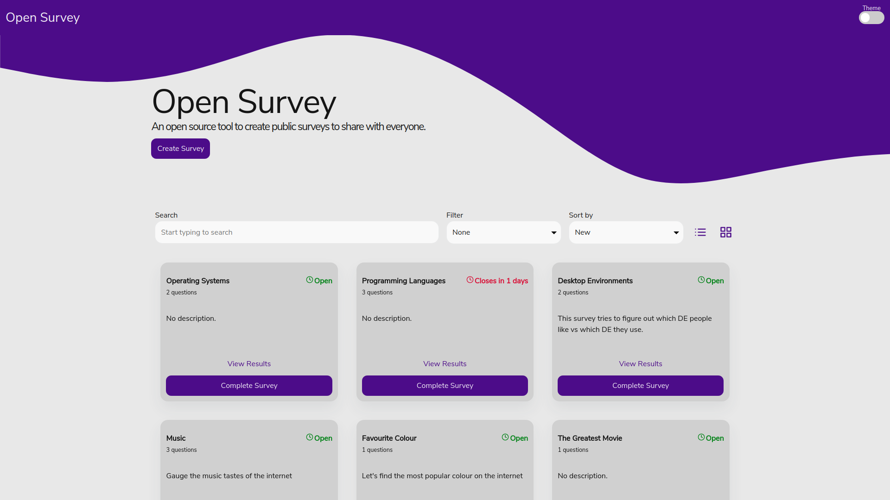
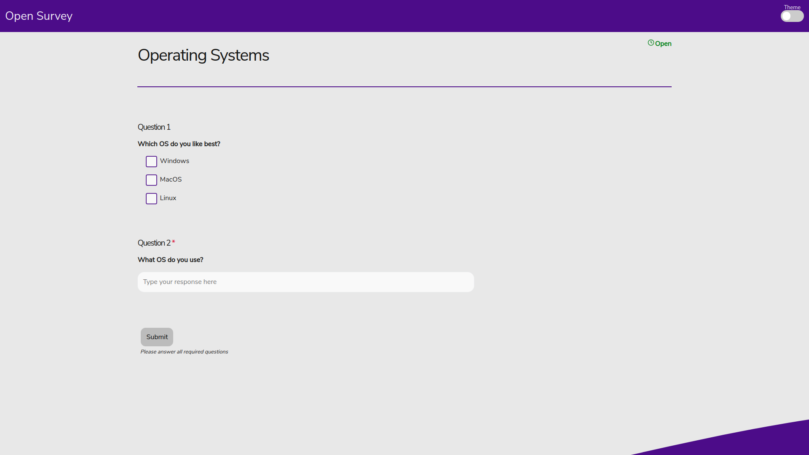

# Open Survey

A open source platform where anyone can create surveys or polls to be answered (anonymously) by others.



## Tech Stack

-   PostgreSQL
-   Node
    -   [Express](https://github.com/expressjs/express)
    -   [node-postgres](https://github.com/brianc/node-postgres) (Postgres client for writing raw queries)
-   React
    -   [Redux](https://github.com/reduxjs/redux) (state management)
    -   [redux-observable](https://github.com/redux-observable/redux-observable) (for asynchronous API calls)
    -   [styled-components](https://github.com/styled-components/styled-components) (for inline React component CSS styles)
    -   heavy use of CSS3 variables (no CSS framework)

## How to run Open Survey

1. Install Node (v12+) and Postgres (v11+)
2. Create a database and database user in postgres
3. Clone the respository
4. Run `npm install` in the `/src/backend` directory
5. Run `npm install` in the `/src/frontend` directory
6. Create a file called `.env` in the `/src/backend` directory will the following format:

```
# PRODUCTION MODE
PRODUCTION=false

# DB INFO
DATABASE_URL=""
DB_USER=<your database username>
DB_PASSWORD=<your database user's password>
DB_HOST=localhost
DB_PORT=<postgres port (default 5432)>
DB_DATABASE=<name of your database>

# PORT THE EXPRESS SERVER RUNS ON
PORT="8888"
```

7. If you use a PORT other than 8888, you will need to change the `.env` file in `/src/fontend` to reflect the port you are using
8. Start the server by running `npm run dev` from the `/src/backend` directory
9. Start the frontend by running `npm start` from the `/src/frontend` directory. It should open your browser automatically, but if not, point your browser to localhost:3000

## Documentation

The back and front end are individually documented.

[Backend Documentation](https://github.com/cyores/opensurvey/tree/master/src/backend)

[Frontend Documentation](https://github.com/cyores/opensurvey/tree/master/src/frontend)

## More Screenshots

#### Dark Mode Home in List View


#### Create Survey Page


#### Survey Page



#### Results Page


#### Sitched (full) Home Page


